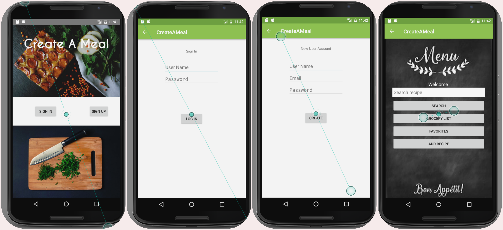

# Create A Meal 


> **By Vanessa Palacios Sharma**



## __Description__


###### Create A Meal helps user choose recipes according to what they have handy. It can filter recipes depending on cuisine preference, type of diet, and/or allergies.


## Known Bugs

> **No Known Bugs**


```
  clone repo using Android Studio checkout Project using VCS
  run application
  select emulator
    * preferably Nexus 6 API 23
  enjoy!
  ```


**Access the remote repository :** [vanessasharma](https://github.com/VanessaSharma/CreateAMeal_Android)


Legal
------

_*Copyright (c) 2016 Vanessa Palacios Sharma*_

###### This software is licensed under the MIT license.


